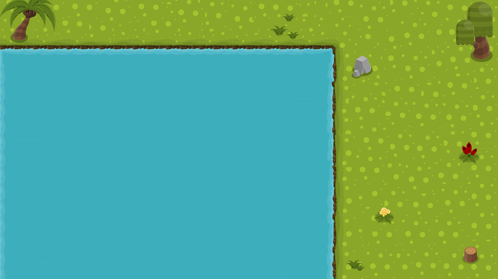

# Project Week Battleship Game

## Description
This is a single player battleship game.  The object of the game is to sink all of the randomly generate battleships on the grid.  Can you beat your best score?

## Visuals
Wireframe

Background

## User Expereince 
AAU(As A User) click on the grid to try and "hit" the battle ship.  
The field will have the following pieces that all need to be destroyed in order to win:
 1 Aircraft carrier 5x1
 1 Battleship 4x1
 1 Submarine  3x1
 2 Destroyer  2x1 

AAU you will see every grid you have clicked if that "shot" missed there will be an item to indicate a miss.
AAU if the shot hits you will see an item indicate they hit, if the shot has sunk that ship you will see a damaged/destroyed ship revealed on the board.
AAU when you win you will have an indication that declares as such, and you can press reset to play again. 

## Contributing
Sun icon made by Freepik from www.flaticon.com
Splash and Boom icons sourced from CLIPARTIX.COM
Credit to Owlish Media for the splash sound.
Explosion sound credit to [timgormly](https://freesound.org/people/timgormly/) of freesound.org under the [creative commons license](https://creativecommons.org/licenses/by/3.0/)
Confetti credit to mathusummut and TimothyJones from their [git](https://github.com/mathusummut/confetti.js)

## Authors and acknowledgment
I am a General Assembly Software Engineering Immmersive fellow.
This game was created with Vanilla JavaScript, HTML, and CSS.
A thank you to my cohort mates, instructors, Stoven, and IndigoPunch for the help and nudge in the right direction when I hit any roadblocks.

## Project status
The project is complete in its inital form however I may revisit this project to add in 2 player functionality. 