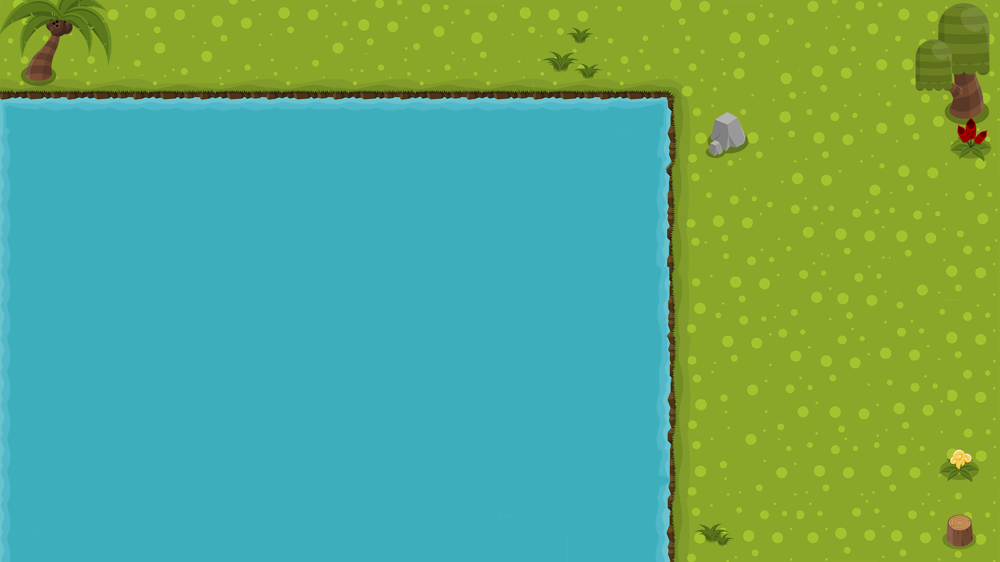

# Project Week Battleship Game

## Description
This is a single player battleship game.  The object of the game is to sink all of the randomly generated ships on the grid.  Can you beat your best score? 
Play the game [here](http://battleshipdestruction.surge.sh/)

## Visuals
Wireframe

Background

## User Expereince 
AAU(As A User) click on the grid to try and "hit" the battle ship.  
The field will have the following pieces that all need to be destroyed in order to win: 
1 Aircraft Carrier 5x1 
1 Battleship 4x1 
1 Submarine 3x1 
1 Cruiser 3x2 
1 Destroyer 2x1  

AAU you will see every grid you have clicked if that "shot" missed there will be an item to indicate a miss. 
AAU if the shot hits you will see an item indicate they hit. 
AAU when you win you will have an indication that declares as such, and you can press reset to play again. 
AAU if you prefer light or dark mode you can click on the Sun/Moon icon and switch the view.   

## Contributing
Sun and Moon icons made by Freepik from www.flaticon.com 
Splash and Boom icons sourced from CLIPARTIX.COM 
Credit to Owlish Media for the splash sound. 
Explosion sound credit to [timgormly](https://freesound.org/people/timgormly/) of freesound.org under the [creative commons license](https://creativecommons.org/licenses/by/3.0/) 
Confetti credit to mathusummut and TimothyJones from their [git](https://github.com/mathusummut/confetti.js) 

## Authors and acknowledgment
I am a General Assembly Software Engineering Immmersive fellow. 
This game was created with Vanilla JavaScript, HTML, and CSS with Bootstrap. 
A thank you to my cohort mates, instructors, Stoven, and IndigoPunch for the help and nudge in the right direction when I hit any roadblocks. 
Can you find the dad joke from icanhazdadjoke.com? 

## Project status
Currently best played at fullscreen on a 1080p resolution, While the project is complete in its initial form I would like to revisit the following: 
Build in media query functionality to clean up the visuals for mobile or smaller resolutions 
Add in 2 player functionality and make appropriate changes to game such as adding the ship sunk indicator.  